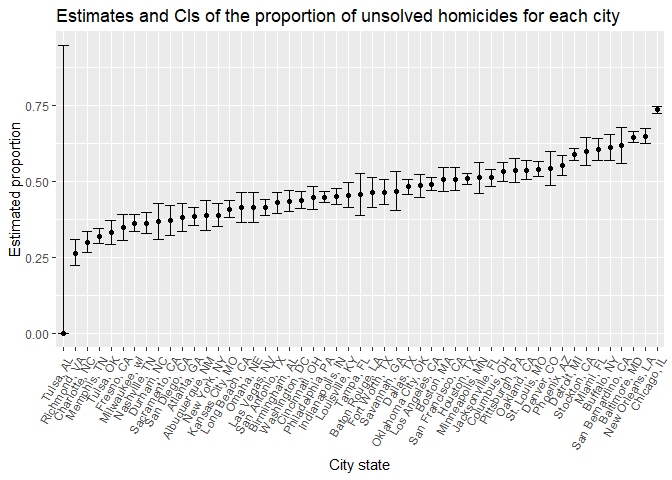

p8105\_hw5\_yh3094
================
Yun He
November 4, 2018

Problem 1
=========

Create a tidy dataframe containing data from all participants
-------------------------------------------------------------

``` r
read_file_data = function(path){
  read_csv(str_c("./data/", path))
}

study_data = 
  tibble(file_name = list.files("./data")) %>% 
  mutate(data = purrr::map(file_name, read_file_data)) %>% 
  unnest() %>% 
  separate(file_name, c("control_arm", "subject_id"), sep = "_") %>% 
  mutate(subject_id = str_remove(subject_id, ".csv")) %>%
  gather(week, obs_value, week_1:week_8) %>% 
  mutate(week = str_remove(week, "week_"))
```

Make a spaghetti plot showing observations on each subject over time
--------------------------------------------------------------------

``` r
study_data %>% 
  mutate(week = as.numeric(week)) %>%
  ggplot(aes(x = week, y = obs_value, color = subject_id)) +
  geom_line() +
  facet_grid(~control_arm) +
  labs(title = "Observations on each subject over time",
       y = "Observation",
       x = "Week")
```


Participants in the experimental arm seem to have higher observations than those in the control arm. In addition, participants in the experimental arm seem to have higher and higher observations over time, while this trend wasn't observed in the control arm.

Problem 2
=========

Import the homicide data
------------------------

``` r
homicide_data = 
  GET("https://raw.githubusercontent.com/washingtonpost/data-homicides/master/homicide-data.csv") %>% 
  content("raw") %>% 
  read_csv()
str(homicide_data)
```

    ## Classes 'tbl_df', 'tbl' and 'data.frame':    52179 obs. of  12 variables:
    ##  $ uid          : chr  "Alb-000001" "Alb-000002" "Alb-000003" "Alb-000004" ...
    ##  $ reported_date: int  20100504 20100216 20100601 20100101 20100102 20100126 20100127 20100127 20100130 20100210 ...
    ##  $ victim_last  : chr  "GARCIA" "MONTOYA" "SATTERFIELD" "MENDIOLA" ...
    ##  $ victim_first : chr  "JUAN" "CAMERON" "VIVIANA" "CARLOS" ...
    ##  $ victim_race  : chr  "Hispanic" "Hispanic" "White" "Hispanic" ...
    ##  $ victim_age   : chr  "78" "17" "15" "32" ...
    ##  $ victim_sex   : chr  "Male" "Male" "Female" "Male" ...
    ##  $ city         : chr  "Albuquerque" "Albuquerque" "Albuquerque" "Albuquerque" ...
    ##  $ state        : chr  "NM" "NM" "NM" "NM" ...
    ##  $ lat          : num  35.1 35.1 35.1 35.1 35.1 ...
    ##  $ lon          : num  -107 -107 -107 -107 -107 ...
    ##  $ disposition  : chr  "Closed without arrest" "Closed by arrest" "Closed without arrest" "Closed by arrest" ...
    ##  - attr(*, "spec")=List of 2
    ##   ..$ cols   :List of 12
    ##   .. ..$ uid          : list()
    ##   .. .. ..- attr(*, "class")= chr  "collector_character" "collector"
    ##   .. ..$ reported_date: list()
    ##   .. .. ..- attr(*, "class")= chr  "collector_integer" "collector"
    ##   .. ..$ victim_last  : list()
    ##   .. .. ..- attr(*, "class")= chr  "collector_character" "collector"
    ##   .. ..$ victim_first : list()
    ##   .. .. ..- attr(*, "class")= chr  "collector_character" "collector"
    ##   .. ..$ victim_race  : list()
    ##   .. .. ..- attr(*, "class")= chr  "collector_character" "collector"
    ##   .. ..$ victim_age   : list()
    ##   .. .. ..- attr(*, "class")= chr  "collector_character" "collector"
    ##   .. ..$ victim_sex   : list()
    ##   .. .. ..- attr(*, "class")= chr  "collector_character" "collector"
    ##   .. ..$ city         : list()
    ##   .. .. ..- attr(*, "class")= chr  "collector_character" "collector"
    ##   .. ..$ state        : list()
    ##   .. .. ..- attr(*, "class")= chr  "collector_character" "collector"
    ##   .. ..$ lat          : list()
    ##   .. .. ..- attr(*, "class")= chr  "collector_double" "collector"
    ##   .. ..$ lon          : list()
    ##   .. .. ..- attr(*, "class")= chr  "collector_double" "collector"
    ##   .. ..$ disposition  : list()
    ##   .. .. ..- attr(*, "class")= chr  "collector_character" "collector"
    ##   ..$ default: list()
    ##   .. ..- attr(*, "class")= chr  "collector_guess" "collector"
    ##   ..- attr(*, "class")= chr "col_spec"

Data on homicides contains 52179 observations and 12 variables. Variable for `reported_date` is class `integer`. Variables for `latitude` and `longitude` are class `numeric`. And all other variables are class `character`.

Create a city\_state variable and summarize
-------------------------------------------

``` r
homicide_data = homicide_data %>% 
  mutate(city_state = str_c(city, state, sep = ", ")) 

## summarize within cities to obtain the total number of homicides
total_homicides = homicide_data %>% 
  group_by(city_state) %>% 
  summarise(n_homicides = n())
total_homicides
```

    ## # A tibble: 51 x 2
    ##    city_state      n_homicides
    ##    <chr>                 <int>
    ##  1 Albuquerque, NM         378
    ##  2 Atlanta, GA             973
    ##  3 Baltimore, MD          2827
    ##  4 Baton Rouge, LA         424
    ##  5 Birmingham, AL          800
    ##  6 Boston, MA              614
    ##  7 Buffalo, NY             521
    ##  8 Charlotte, NC           687
    ##  9 Chicago, IL            5535
    ## 10 Cincinnati, OH          694
    ## # ... with 41 more rows

``` r
## summarize within cities to obtain the number of unsolved homicides
unsolved_homicides = homicide_data %>% 
  group_by(city_state) %>% 
  summarise(n_unsloved = sum(disposition %in% c("Closed without arrest", "Open/No arrest")))
unsolved_homicides
```

    ## # A tibble: 51 x 2
    ##    city_state      n_unsloved
    ##    <chr>                <int>
    ##  1 Albuquerque, NM        146
    ##  2 Atlanta, GA            373
    ##  3 Baltimore, MD         1825
    ##  4 Baton Rouge, LA        196
    ##  5 Birmingham, AL         347
    ##  6 Boston, MA             310
    ##  7 Buffalo, NY            319
    ##  8 Charlotte, NC          206
    ##  9 Chicago, IL           4073
    ## 10 Cincinnati, OH         309
    ## # ... with 41 more rows

``` r
homicide = full_join(total_homicides, unsolved_homicides, by = "city_state")
homicide
```

    ## # A tibble: 51 x 3
    ##    city_state      n_homicides n_unsloved
    ##    <chr>                 <int>      <int>
    ##  1 Albuquerque, NM         378        146
    ##  2 Atlanta, GA             973        373
    ##  3 Baltimore, MD          2827       1825
    ##  4 Baton Rouge, LA         424        196
    ##  5 Birmingham, AL          800        347
    ##  6 Boston, MA              614        310
    ##  7 Buffalo, NY             521        319
    ##  8 Charlotte, NC           687        206
    ##  9 Chicago, IL            5535       4073
    ## 10 Cincinnati, OH          694        309
    ## # ... with 41 more rows

Data analysis of the city of Baltimore, MD
------------------------------------------

``` r
baltimore = homicide %>% filter(city_state == "Baltimore, MD")
prop_test_balti = prop.test(baltimore$n_unsloved, baltimore$n_homicides)
tibble(
  city_state = "Baltimore, MD",
  estimated_prop = broom::tidy(prop_test_balti) %>% pull(estimate),
  conf_low = broom::tidy(prop_test_balti) %>% pull(conf.low),
  conf_high = broom::tidy(prop_test_balti) %>% pull(conf.high)
)
```

    ## # A tibble: 1 x 4
    ##   city_state    estimated_prop conf_low conf_high
    ##   <chr>                  <dbl>    <dbl>     <dbl>
    ## 1 Baltimore, MD          0.646    0.628     0.663

Run the analysis in the whole dataset
-------------------------------------

``` r
prop_test_result = function(x, n){
  result = broom::tidy(prop.test(x, n))
  tibble(
    estimated_prop = result %>% pull(estimate),
    conf_low = result %>% pull(conf.low),
    conf_high = result %>% pull(conf.high)
  )
}

homicide %>% 
  mutate(prop_test_result = purrr::map2(n_unsloved, n_homicides, prop_test_result)) %>% 
  unnest()
```

    ## Warning in prop.test(x, n): Chi-squared approximation may be incorrect

    ## # A tibble: 51 x 6
    ##    city_state      n_homicides n_unsloved estimated_prop conf_low conf_high
    ##    <chr>                 <int>      <int>          <dbl>    <dbl>     <dbl>
    ##  1 Albuquerque, NM         378        146          0.386    0.337     0.438
    ##  2 Atlanta, GA             973        373          0.383    0.353     0.415
    ##  3 Baltimore, MD          2827       1825          0.646    0.628     0.663
    ##  4 Baton Rouge, LA         424        196          0.462    0.414     0.511
    ##  5 Birmingham, AL          800        347          0.434    0.399     0.469
    ##  6 Boston, MA              614        310          0.505    0.465     0.545
    ##  7 Buffalo, NY             521        319          0.612    0.569     0.654
    ##  8 Charlotte, NC           687        206          0.300    0.266     0.336
    ##  9 Chicago, IL            5535       4073          0.736    0.724     0.747
    ## 10 Cincinnati, OH          694        309          0.445    0.408     0.483
    ## # ... with 41 more rows

Create a plot that shows the estimates and CIs for each city
------------------------------------------------------------

``` r
homicide %>% 
  mutate(prop_test_result = purrr::map2(n_unsloved, n_homicides, prop_test_result)) %>% 
  unnest() %>% 
  mutate(city_state = fct_reorder(city_state, estimated_prop)) %>% 
  ggplot(aes(x = city_state, y = estimated_prop)) +
  geom_point() +
  geom_errorbar(aes(ymin = conf_low, ymax = conf_high)) +
  theme(axis.text.x = element_text(angle = 60, hjust = 1)) +
  labs(title = "Estimates and CIs of the proportion of unsolved homicides for each city",
       y = "Estimated proportion",
       x = "City state")
```

    ## Warning in prop.test(x, n): Chi-squared approximation may be incorrect


