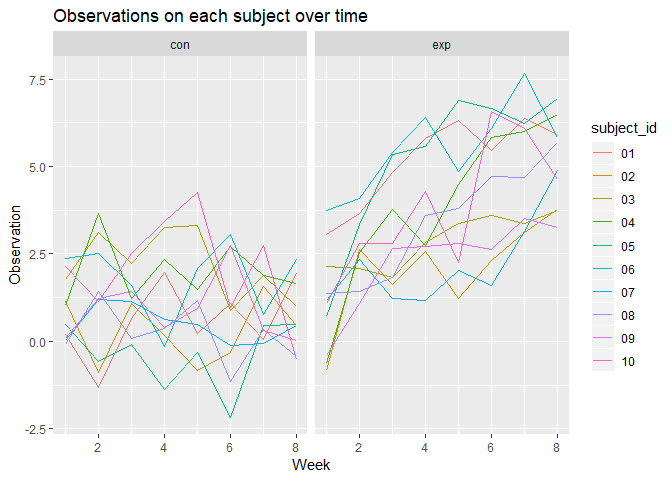

p8105\_hw5\_yh3094
================
Yun He
November 4, 2018

Problem 1
=========

Create a tidy dataframe containing data from all participants
-------------------------------------------------------------

``` r
read_file_data = function(path){
  read_csv(str_c("./data/", path))
}

study_data = 
  tibble(file_name = list.files("./data")) %>% 
  mutate(data = purrr::map(file_name, read_file_data)) %>% 
  unnest() %>% 
  separate(file_name, c("control_arm", "subject_id"), sep = "_") %>% 
  mutate(subject_id = str_remove(subject_id, ".csv")) %>%
  gather(week, obs_value, week_1:week_8) %>% 
  mutate(week = str_remove(week, "week_"))
```

Make a spaghetti plot showing observations on each subject over time
--------------------------------------------------------------------

``` r
study_data %>% 
  mutate(week = as.numeric(week)) %>%
  ggplot(aes(x = week, y = obs_value, color = subject_id)) +
  geom_line() +
  facet_grid(~control_arm)
```



Participants in the experimental arm seem to have higher observations than those in the control arm. In addition, participants in the experimental arm seem to have higher and higher observations over time, while this trend wasn't observed in the control arm.

Problem 2
=========
